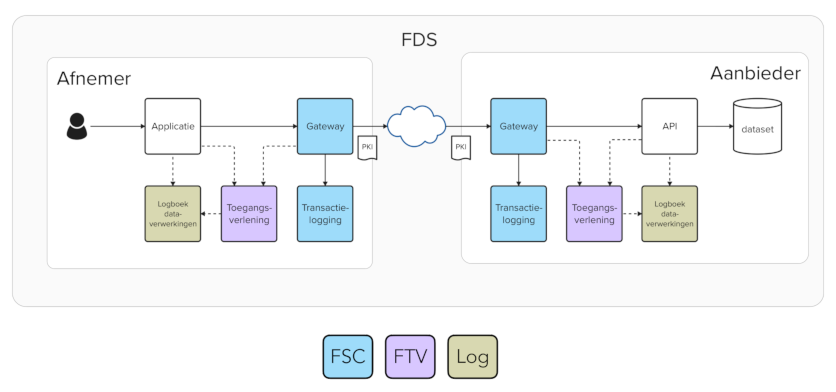

# Overzicht API stelsel

In de onderstaande figuur staan de componenten geschetst die in het API berichtenverkeer een rol spelen.

<!--- NB: bij MKDocs wordt dit

--->
<!--- NB: bij Respec wordt dit --->

<!--- --->

In deze figuur betekent:

FDS: [Federatief Datastelsel](https://realisatieibds.nl/page/view/564cc96c-115e-4e81-b5e6-01c99b1814ec/de-ontwikkeling-van-het-federatief-datastelsel) (hier niet relevant, maar dit schema is daaraan ontleend en geeft aan dat DDAS past in een Federatief Datastelsel)

Afnemer: CBS

Aanbieder: de schuldhulpverlenende organisatie of de gegevensleverancier hiervan

PKI: [Public Key Infrastructure](https://nl.wikipedia.org/wiki/Public_key_infrastructure) - systeem voor het uitgeven en beheren van digitale certificaten

FSC: [Federatieve Services Connectiviteit](https://fsc-standaard.nl/) - standaard voor het leggen van koppelingen m.b.v. API's

FTV: [Federatieve Toegangsverlening](https://digilab.overheid.nl/projecten/toegangsverleningmethodiek-api/) (hier niet relevant, maar kan bij meer complexe toegangsverlening kan deze standaard gebruikt worden)

Log: Logging t.b.v. monitoring en verantwoording

Deze specificatie richt zich primair op de beschrijving van de API (rechtsboven in de figuur bij de aanbieder van gegevens), maar ook de andere componenten worden benoemd.
Bent u enkele geïnteresseerd in de OpenAPI specificatie van de API? Deze staat onder het kopje "Berichten".
